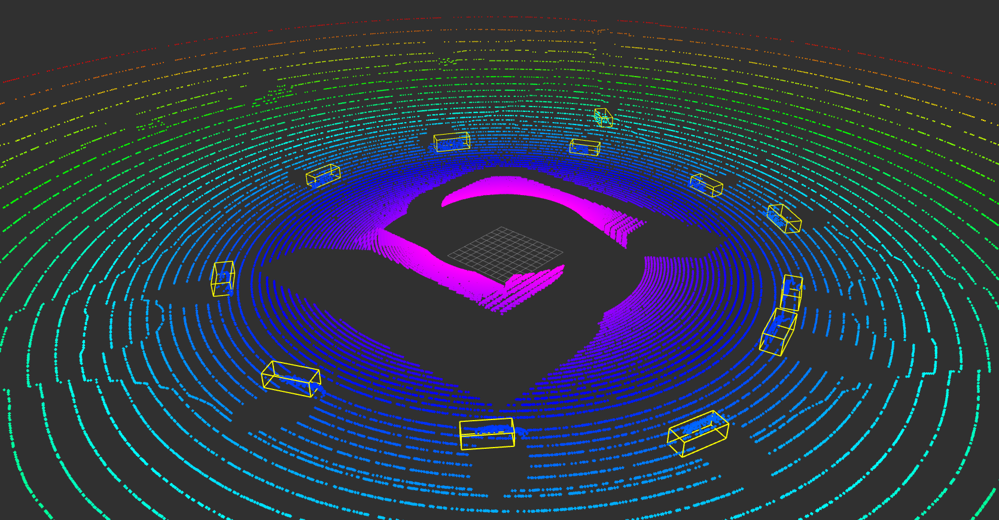

# sensus-loci
3D object detection from infrastructure




# Installation

```
git clone https://github.com/ramajoballester/sensus-loci.git
cd sensus-loci
git submodule init
git submodule update
cd mmdetection3d
git checkout 1.1
```

With conda (or your favorite virtual environment manager) install the latest version of python 3.8:

```
conda install python=3.8.*
```

Install pytorch 1.13 with GPU support from the [official website](https://pytorch.org/get-started/previous-versions/).

After that, install the rest of the dependencies, from inside mmdection3d directory:

```
pip install -U openmim
mim install mmengine
mim install 'mmcv>=2.0.0rc0'
mim install 'mmdet>=3.0.0rc0'
pip install -e .
```

After installing mmdetection3d, install sensus-loci. To do so, go back to the root directory of the project:

```
cd ..
pip install -e .
```

To install the ros_sensus ROS2 package, go to the ros directory ```./sensus/ros``` and follow the instructions for [ROS2 installation](./sensus/ros).


## Known issues

- Problems with **compiling** wheels for: ```mim install mmcv-full``` are due to pytorch shipping nvcc in the latest release. Fix it by indicating its true path 
```export PATH=/usr/local/cuda/bin:$PATH```. Bug [#2684](https://github.com/microsoft/DeepSpeed/issues/2684)


# Linear algebra review

Homogeneous transformation matrix:

$$
\left(\begin{array}{cc} 
R_{3x3} & t_{3x1}\\
p_{1x3} & s_{1x1}
\end{array}\right) =
\left(\begin{array}{cc}
Rotation & Translation\\
perspective=0 & scale=1
\end{array}\right)
$$

Composition of transformations:
- With translations and rotation given a fixed frame of reference, new operations are composed as **pre-product**.
- With translations and rotation given a moving frame of reference, new operations are composed as **post-product**.


# KITTI Dataset


## Data format

**Directories**
- ImageSets/: contains train.txt, val.txt, trainval.txt (union of previous two), and test.txt. These files contain the list of image ids in 6-digit integer format.
- ```training/```: contains 7481 training samples
    - ```calib/```: contains calibration files. Each line in a calibration file is a 12-element vector, which is the 3x4 projection matrix from the rectified camera coordinate to the image coordinate.
    - ```image_2/```: contains left color images in png format
    - ```label_2/```: contains 2D and 3D bounding boxes in txt format. For each row, the annotation of each object is provided with 15 columns camera coordinates:
    ```type | truncation | visibility | observation angle | xmin | ymin |xmax | ymax | height | width | length | tx | ty | tz | roty```
    - ```velodyne/```: contains point clouds in bin format. Each point is a 4-element vector: ```x, y, z, intensity```.
- ```testing/```: contains 7518 testing samples (without label_2)


**calib files**:
- PX: projection matrix from rectified camera coordinate to image coordinate. Camera 0 is the reference camera coordinate.
- R0_rect: rectification matrix from camera coordinate to rectified camera coordinate. Remember that the camera rig is intended for stereo vision.
- Tr_velo_to_cam: transformation matrix from velodyne to camera coordinate
- Tr_imu_to_velo: transformation matrix from imu to velodyne coordinate

Example 1: Project 3D bouding boxes from reference camera coordinate (?: from object coordinate) to camera_2 image

$$ y_{image} = P_2 * R_{0\_rect} * R_{0\_rot} * x_{ref} $$

$R_{0\_rot}$ is the rotation matrix to map from object coordinate to reference coordinate

Example 2: Project velodyne coordinate point to camera 2 image
$$ y_{image} = P_2 * R_{0\_rect} * T_{r\_velo\_to\_cam} * x_{velo} $$


## Data conversion

```python tools/create_data.py kitti --root-path ./data/kitti --out-dir ./data/kitti --extra-tag kitti```

1. Create info file
2. Create reduced point cloud
3. Create ground truth database


## Inference


## Predictions

LiDARInstance3DBoxes: ```(x, y, z, x_size, y_size, z_size, yaw) ```

## TODO

1. Check how pc are "reduced" in create_data.py


# NuScenes Dataset

390k lidar sweeps: 40k in samples and 350k in sweeps


# Visualization

Online with Open3D: issue when there is no connected display monitor. TODO: run it headless.

Offline locally with Meshlab loading the .obj files.

TODO: visualization with another visualizer object


# Roadmap

- [ ] Point cloud range is in KITTI lidar coordinate system (x: forward, y: left, z: up).
- [ ] ROS-based inference should forward input point cloud through test pipeline. In the meantime, model will output directly from input point cloud.
- [ ] Use kitti models with custom configs for infrastructure (ros)
    - [ ] Compare raw and processed point clouds in KITTI
    - [ ] Compare them with ROS point clouds
- [ ] Create custom dataset for infrastructure (DAIR-V2X-I)
